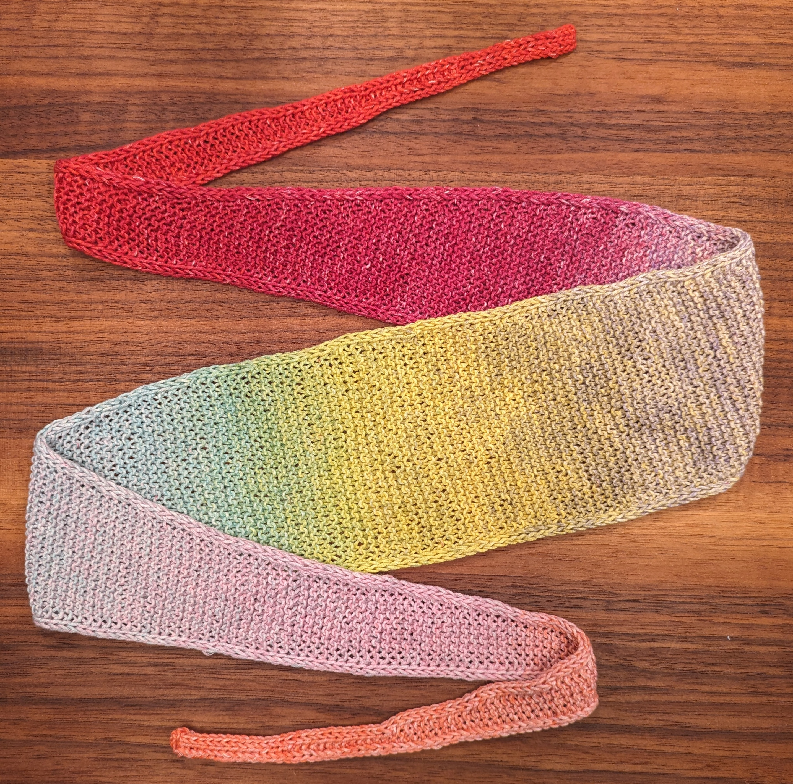
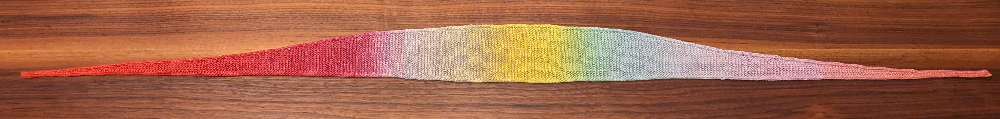

# Knit

## Introduction

Knit is a web application to help you knit simple wavy scarfs.
It allows you to specify a few input parameters
concerning the scarf's length and shape
in order to generate the "pattern":
the sequence of rows that you can knit.
Knit displays a render of the scarf
(given your input parameters)
and helps you keep track of which row you're on.

The scarf shapes (i.e., the position of increases and decreases)
are generated using Bézier curves given the input parameters.

This application state is contained entirely in the browser.
There is no server-side component or communication
(beyond just loading the static files).

## Example

The following is a scarf I knit ([parameters](https://alefore.github.io/knit/#TotalLength=654&CenterWidth=26&Shape=Thin)):

## Using Knit

In order to knit a new scarf using this software:

1. Load it from the Github page:
   https://alefore.github.io/knit/

2. Optionally, save a local copy.
   I recommend using a local copy
   as a way to freeze the version you're working on.
   I may change the implementation.

3. Configure your scarf:
   play with the parameters until you're satisfied.
   I recommend you knit a small swatch to get gauge;
   that would let you decide
   the length and width of your scarf in rows and stitches.

4. Unless you plan to knit your entire scarf
   (which typically takes a few hours, depending on your parameters)
   in a single sitting,
   I'd recommend that you do a simple test:
   advance a few rows (without knitting),
   put your phone (or computer) away (e.g., lock it or such),
   and come back to your browser
   to confirm that it correctly remembers which row you were on.

5. Cast-on 6 stitches.
   This is the left tip of your scarf.

6. Work through the rows.
   Start at row 0.
   Whenever you finish a row, clock "Next" to advance.
   You can also press space, up or down;
   on mobile devices, you can swipe left or right.

### Display

Rows look something like this: "92↓ (13 Δ1) 2K KFB 6K WYIF 3SLP"

In this case:

* 92 is the number of row (starting at 0, so this would be the 93rd row).

* ↓ tells you the direction you're knitting in
  (relative to the render).
  You can also think of down as "right side"
  and up as "wrong side".

* (13 Δ1) tells you that you should have 13 stitches at the end of this row.
  The delta, if present, tells you that this row increases
  the number of stitches by the amount given
  (or shrinks, if negative).

* The rest are the steps for this row.

* The percentage number (shown only for the current row)
  is an estimate of how much of the scarf you've already knitted
  (at the start of this row).
  This is based on a simple calculation
  based on the number of stitches in all rows.

## Future

The following is a list of things I'd like to add:

* Clock that counts how much time you've spent in each row.
  This would help me know if I've forgotten to register completion of a row.

* More patterns.
  There's nothing in the underlying software that is specific to these scarfs.
  This should support socks and hats and …
